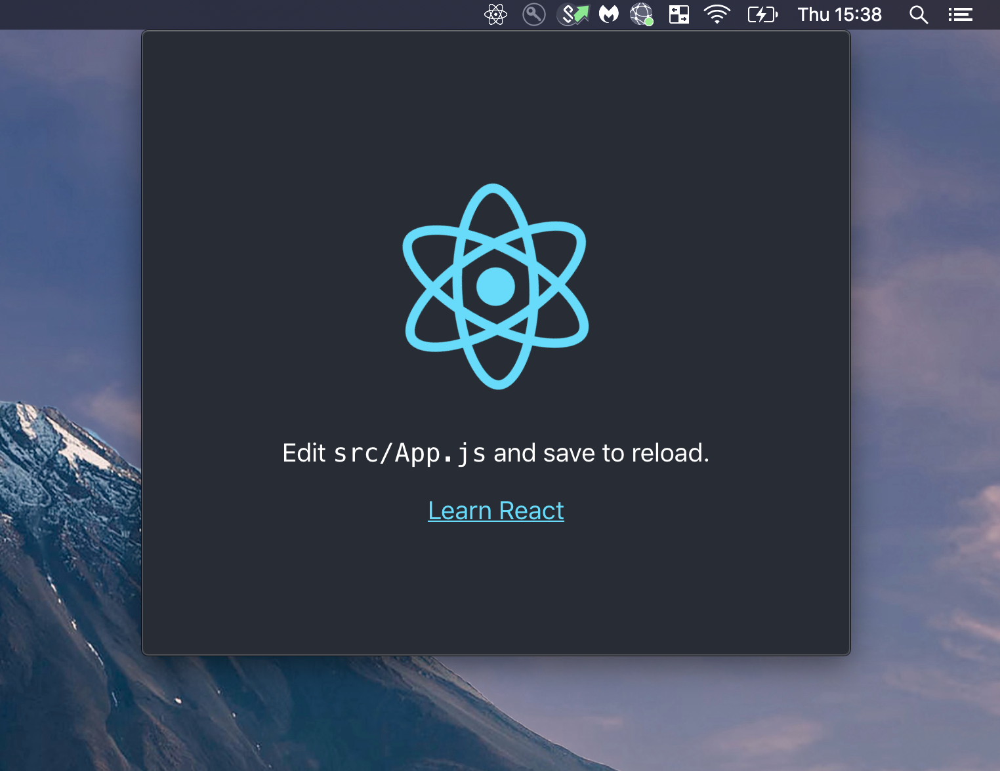

# React Electron Menubar

A wrapper of https://github.com/maxogden/menubar to include React

## Available Scripts

In the project directory, you can run:

### `yarn start`

Runs the app in the development mode with a window that is always on top 

The page will reload if you make edits. 
You will also see any lint errors in the console.

### `yarn test`

Launches the test runner in the interactive watch mode. 
See the section about [running tests](https://facebook.github.io/create-react-app/docs/running-tests) for more information.

### `yarn build:mac`

Builds a Mac app for production to the `dist` folder. 
The following formats are generated: .zip, .dmg, .app

### `yarn build:windows`

Builds a Windows app for production to the `dist` folder. 

